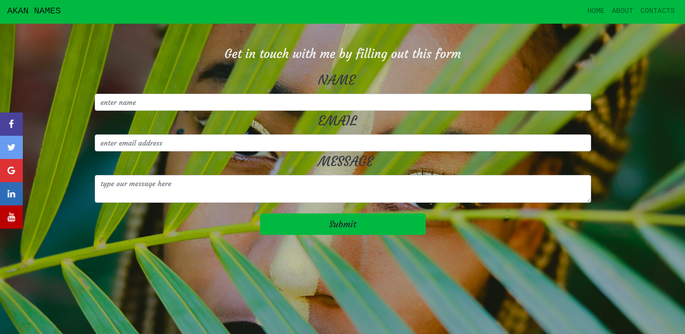

# Project Name
AKAN NAMES
## Project description
The project basically explains the use of the akan naming system in Ghana whereby one can get his/her name depending on their gender and the day that he/she was born.
## Author
- Odoyo Grace Awino
## Technologies Used
- HTML5-I used HTML5 for structuring my website.
- CSS3-I used CSS3 and bootstrap for styling my website and making the - landing page.
- Javascript-I used javascript for dynamics.
## User Story

- Basically,this is the landing page of the Akan Names website where the user gets to know more about the website.

-   When the user goes to the about page,they see a form which they fill in their birth details and select their gender then click the submit button which inturn shows them their Akan Name and the day that they were born.

- On the contacts page,the user enters their name,email address and then a message then clicks the submit button to send their message for more information on Akan Names.

## Live links
 - gh-pages link-https://odoyoquee.github.io/Akan-names-/

 ## Contact Information
 Email address: odoyograce23@gmail.com
 Phone: 0726294456

 ## License and Copyright Information
  - MIT License Copyright (c) 2020 (Odoyo Grace Awino)
 - - 

